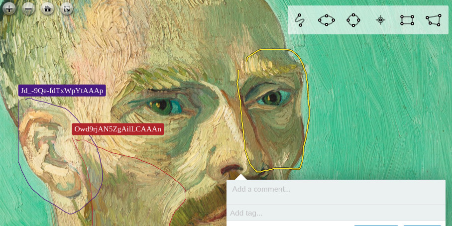

# Annotorious Real-Time Annotation Server

An experimental annotation server that enables GoogleDocs-style live 
collaboration in Annotorious. Built with RethinkDB and NodeJS. Try the 
online demo here:

__<https://realtime-demo.annotorious.com/>__



__This project is work in progress! Want to learn more? Deploy your own server? 
Contribute to development? Get in touch via the 
[Annotorious Gitter chat](https://gitter.im/recogito/annotorious) or send me
[a DM on twitter](https://twitter.com/aboutgeo)!__

## Database Installation

The included `docker-compose.yml` will install and start a RethinkDB instance locally via Docker.

`$ docker-compose up`

The RethinkDB admin interface will be available at <http://localhost:8081> 

## Annotation Server

The Annotation Server is a simple [ExpressJS](http://expressjs.com/) API on top of RethinkDB. 
To start the server in development mode:

```sh
$ cd server
$ npm install
```

Create a copy of the file `.env.example` named `.env` and configure according to your environment.

```sh
$ npm run dev
```

The server will be available at <http://localhost:8080>

## Client

Annotorious requires a client plugin to connect the server and manage live syncing. For the time being, you can run this in dev mode:

```sh
$ cd client
$ npm install
$ npm start
```
